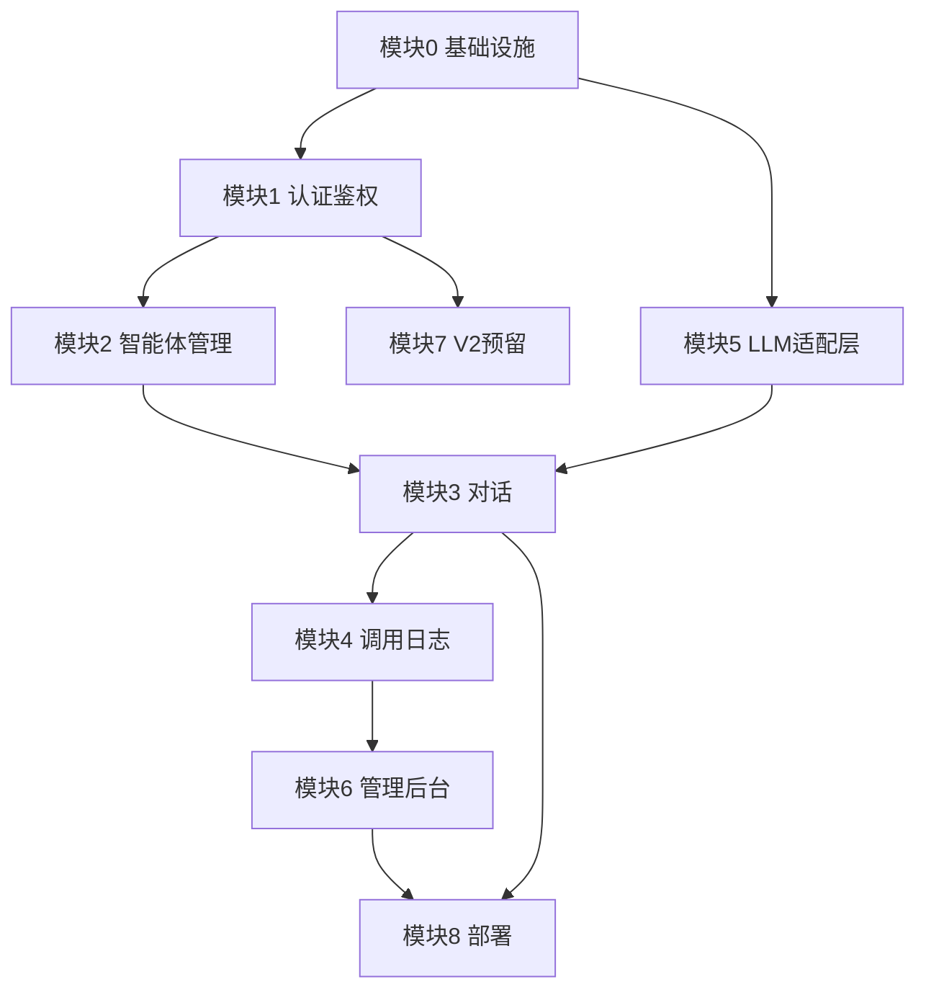

# 开发任务清单 V1

> 基于 PRD.md 和《01-PRD-边界锁定.md》产出的完整任务拆解。
> 共 74 个任务,9 个模块,全职开发预估 25-33 天。

## 版本

- v1.0
- 最后更新:2026-04-16

---

## 使用说明

### 优先级定义

- **P0**:MVP 必做,不做就跑不通主链路
- **P1**:MVP 重要,但可以先用简化版,后期再完善
- **P2**:V2 再做,MVP 阶段只预留接口/数据结构

### 工作量定义

- **S**(Small):半天内能搞定
- **M**(Medium):1-2 天
- **L**(Large):3-5 天

### 任务状态(开发时自行维护)

- ⬜ 未开始
- 🟨 进行中
- ✅ 已完成
- ⏸️ 已搁置

---

## 模块 0:基础设施与项目初始化

| # | 任务 | 优先级 | 工作量 | 依赖 | 状态 |
|---|---|---|---|---|---|
| 0.1 | Next.js App Router 项目初始化(TypeScript + Tailwind + shadcn/ui) | P0 | S | - | ✅ |
| 0.2 | 项目目录结构规划(app / components / lib / types) | P0 | S | 0.1 | ✅ |
| 0.3 | Supabase 项目创建 + 本地环境变量配置(.env.local) | P0 | S | - | ✅ |
| 0.4 | Supabase 客户端封装(server / client 两种实例) | P0 | S | 0.3 | ✅ |
| 0.5 | 基础 UI 组件引入(Button / Input / Card / Dialog / Toast 等) | P0 | S | 0.1 | ✅ |
| 0.6 | 多子域路由规划(本地用 middleware 模拟 app.* / admin.*) | P1 | M | 0.1 | ✅ |
| 0.7 | Git 仓库初始化 + README + .gitignore | P0 | S | - | ✅ |

**模块小计**:7 个任务,1-2 天

---

## 模块 1:认证与鉴权(auth)

| # | 任务 | 优先级 | 工作量 | 依赖 | 状态 |
|---|---|---|---|---|---|
| 1.1 | `profiles` 表创建(id / email / role / created_at) | P0 | S | 0.3 | ✅ |
| 1.2 | Supabase Auth 配置(邮箱密码登录开启) | P0 | S | 0.3 | ✅ |
| 1.3 | 注册回调 Trigger:新用户自动创建 profile 记录 | P0 | M | 1.1, 1.2 | ✅ |
| 1.4 | 白名单邮箱逻辑:注册时检查 `ADMIN_EMAILS`,自动设 role | P0 | M | 1.3 | ✅ |
| 1.5 | 登录页 UI(`/login`) | P0 | M | 0.5 | ✅ |
| 1.6 | 注册页 UI(与登录同页切换) | P0 | S | 1.5 | ✅ |
| 1.7 | Next.js Middleware:未登录用户访问 `app.*` 重定向到登录页 | P0 | M | 1.2 | ✅ |
| 1.8 | Middleware:非管理员访问 `admin.*` 拒绝 | P0 | S | 1.4, 1.7 | ✅ |
| 1.9 | 顶部导航栏:显示当前用户邮箱 + 退出登录 | P0 | S | 1.7 | ✅ |

**模块小计**:9 个任务,2-3 天

---

## 模块 2:智能体管理(agents)

| # | 任务 | 优先级 | 工作量 | 依赖 | 状态 |
|---|---|---|---|---|---|
| 2.1 | `agents` 表创建(含 `status`:draft/published/disabled) | P0 | S | 0.3 | ⬜ |
| 2.2 | Supabase RLS 策略:用户只能读写自己的 agents | P0 | M | 2.1 | ⬜ |
| 2.3 | API:`GET /api/agents`(列表) | P0 | S | 2.2 | ⬜ |
| 2.4 | API:`POST /api/agents`(创建) | P0 | S | 2.2 | ⬜ |
| 2.5 | API:`PATCH /api/agents/:id`(更新) | P0 | S | 2.2 | ⬜ |
| 2.6 | API:`DELETE /api/agents/:id`(删除,前置检查活跃会话) | P0 | M | 2.2, 3.1 | ⬜ |
| 2.7 | 智能体列表页 UI(`/agents`) | P0 | M | 2.3 | ⬜ |
| 2.8 | "创建智能体"对话框(名称 + 描述) | P0 | S | 2.4 | ⬜ |
| 2.9 | 智能体配置页 UI(`/agents/:id`,含 Prompt / 模型 / 温度) | P0 | L | 2.5 | ⬜ |
| 2.10 | 配置页的模型选择下拉(MVP 只列 DeepSeek 的模型) | P0 | S | 2.9, 5.1 | ⬜ |
| 2.11 | 配置页的状态切换(草稿/发布/停用) | P0 | S | 2.9 | ⬜ |
| 2.12 | 状态流转校验(只有"已发布"才能被对话页选中) | P0 | S | 2.11 | ⬜ |

**模块小计**:12 个任务,4-5 天

---

## 模块 3:对话(chat)

| # | 任务 | 优先级 | 工作量 | 依赖 | 状态 |
|---|---|---|---|---|---|
| 3.1 | `chat_sessions` 表创建 | P0 | S | 0.3 | ⬜ |
| 3.2 | `chat_messages` 表创建 | P0 | S | 0.3 | ⬜ |
| 3.3 | RLS 策略:用户只能访问自己的会话和消息 | P0 | M | 3.1, 3.2 | ⬜ |
| 3.4 | API:`POST /api/chat/sessions`(创建会话) | P0 | S | 3.3 | ⬜ |
| 3.5 | API:`GET /api/chat/sessions`(列出当前用户的会话) | P0 | S | 3.3 | ⬜ |
| 3.6 | API:`GET /api/chat/sessions/:id/messages`(历史消息) | P0 | S | 3.3 | ⬜ |
| 3.7 | API:`POST /api/chat/sessions/:id/messages`(发消息,SSE 流式) | P0 | L | 3.3, 5.3 | ⬜ |
| 3.8 | 对话页布局(`/chat`,左侧会话列表 + 右侧消息区) | P0 | L | 0.5 | ⬜ |
| 3.9 | 智能体选择器(新建会话时选 agent) | P0 | M | 3.4, 2.7 | ⬜ |
| 3.10 | 消息气泡组件(用户/助手区分,支持 Markdown 渲染) | P0 | M | 3.8 | ⬜ |
| 3.11 | 流式输出前端处理(打字机效果) | P0 | M | 3.7, 3.10 | ⬜ |
| 3.12 | 输入框组件(回车发送,Shift+Enter 换行,发送中禁用) | P0 | S | 3.8 | ⬜ |
| 3.13 | 会话详情页(`/chat/:id`) | P0 | M | 3.8 | ⬜ |
| 3.14 | 会话重命名功能 | P1 | S | 3.13 | ⬜ |
| 3.15 | 多轮对话上下文管理(按消息条数截断,MVP 定 20 条) | P0 | M | 3.7 | ⬜ |
| 3.16 | 会话自动命名(第一条消息的前 20 字) | P1 | S | 3.7 | ⬜ |

**模块小计**:16 个任务,6-7 天(最重的模块)

---

## 模块 4:调用日志(logs)

| # | 任务 | 优先级 | 工作量 | 依赖 | 状态 |
|---|---|---|---|---|---|
| 4.1 | `run_logs` 表创建(含 `prompt_snapshot` jsonb + `response_snapshot` text) | P0 | S | 0.3 | ⬜ |
| 4.2 | RLS 策略:用户只能看自己的日志,管理员看全部 | P0 | M | 4.1 | ⬜ |
| 4.3 | 日志写入:`POST /api/chat/.../messages` 成功/失败时插入 | P0 | M | 3.7, 4.1 | ⬜ |
| 4.4 | 日志记录:耗时 / token 消耗 / 状态 / 错误信息 | P0 | M | 4.3 | ⬜ |
| 4.5 | API:`GET /api/logs`(分页 + 筛选 status/model/agent) | P0 | M | 4.2 | ⬜ |
| 4.6 | 日志页 UI(`/logs`,表格形式) | P0 | M | 4.5 | ⬜ |
| 4.7 | 日志详情抽屉(完整 prompt 快照 + 响应) | P0 | M | 4.6 | ⬜ |
| 4.8 | 筛选器组件(状态 / 模型 / 智能体 / 时间范围) | P1 | M | 4.6 | ⬜ |

**模块小计**:8 个任务,3-4 天

---

## 模块 5:LLM 适配层

| # | 任务 | 优先级 | 工作量 | 依赖 | 状态 |
|---|---|---|---|---|---|
| 5.1 | 定义 `LLMProvider` 接口(chat 方法,支持 stream) | P0 | S | 0.2 | ⬜ |
| 5.2 | `DeepSeekProvider` 实现(调用 DeepSeek API) | P0 | M | 5.1 | ⬜ |
| 5.3 | 统一消息格式 + 错误处理 + 超时控制 | P0 | M | 5.2 | ⬜ |
| 5.4 | Provider 工厂函数(根据 model 字段路由) | P0 | S | 5.2 | ⬜ |
| 5.5 | DeepSeek API Key 配置(环境变量,服务端访问) | P0 | S | 5.2 | ⬜ |
| 5.6 | 适配层单元测试(mock API 调用) | P1 | M | 5.4 | ⬜ |

**模块小计**:6 个任务,约 2 天

---

## 模块 6:管理后台(admin)

| # | 任务 | 优先级 | 工作量 | 依赖 | 状态 |
|---|---|---|---|---|---|
| 6.1 | API:`GET /api/admin/overview`(总览指标) | P0 | M | 4.2 | ⬜ |
| 6.2 | 后台首页 UI(`/admin`,指标卡片布局) | P0 | M | 6.1 | ⬜ |
| 6.3 | 指标:用户数 / 智能体数 / 调用数 / 失败率 | P0 | S | 6.1 | ⬜ |
| 6.4 | 用户与调用概览页(`/admin/usage`,表格 + 简单图表) | P1 | L | 6.1 | ⬜ |
| 6.5 | 后台布局:独立侧边栏 + 与用户控制台视觉区分 | P1 | M | 0.5 | ⬜ |

**模块小计**:5 个任务,2-3 天

---

## 模块 7:V2 预留(MVP 阶段只做数据结构/占位)

| # | 任务 | 优先级 | 工作量 | 依赖 | 状态 |
|---|---|---|---|---|---|
| 7.1 | `knowledge_bases` 表结构设计(写在文档里,不建表) | P2 | S | - | ⬜ |
| 7.2 | `documents` 表结构设计 | P2 | S | - | ⬜ |
| 7.3 | `agent_knowledge_bindings` 中间表结构设计 | P2 | S | - | ⬜ |
| 7.4 | 前端侧边栏"知识库"导航项 + "即将上线"标签 | P0 | S | 0.5 | ⬜ |
| 7.5 | `/knowledge` 路由的空页面(显示"即将上线") | P0 | S | 7.4 | ⬜ |

**模块小计**:5 个任务,约半天

---

## 模块 8:官网 + 联调 + 部署

| # | 任务 | 优先级 | 工作量 | 依赖 | 状态 |
|---|---|---|---|---|---|
| 8.1 | 官网首页简易版(`www.xxx.com`,一屏介绍 + 登录 CTA) | P1 | M | 0.5 | ⬜ |
| 8.2 | Vercel 项目创建 + 环境变量配置 | P0 | S | - | ⬜ |
| 8.3 | Vercel 部署调试(域名绑定 / 子域配置) | P0 | M | 8.2 | ⬜ |
| 8.4 | 端到端联调:走一遍完整用户路径 | P0 | M | 所有 P0 | ⬜ |
| 8.5 | 移动端对话页适配(PRD 要求"至少可查看") | P1 | M | 3.8 | ⬜ |
| 8.6 | README 演示说明(启动 / 登录 / 演示方法) | P0 | S | 8.4 | ⬜ |

**模块小计**:6 个任务,2-3 天

---

## 总汇总

| 模块 | 任务数 | P0 数 | P1 数 | P2 数 | 预估工作量 |
|---|---|---|---|---|---|
| 0. 基础设施 | 7 | 6 | 1 | 0 | 1-2 天 |
| 1. 认证鉴权 | 9 | 9 | 0 | 0 | 2-3 天 |
| 2. 智能体管理 | 12 | 12 | 0 | 0 | 4-5 天 |
| 3. 对话 | 16 | 14 | 2 | 0 | 6-7 天 |
| 4. 调用日志 | 8 | 7 | 1 | 0 | 3-4 天 |
| 5. LLM 适配层 | 6 | 5 | 1 | 0 | 2 天 |
| 6. 管理后台 | 5 | 3 | 2 | 0 | 2-3 天 |
| 7. V2 预留 | 5 | 2 | 0 | 3 | 0.5 天 |
| 8. 官网+部署 | 6 | 4 | 2 | 0 | 2-3 天 |
| **合计** | **74** | **62** | **9** | **3** | **约 25-33 天** |

---

## 建议开发顺序(对齐 PRD §11)

**原则**:优先跑通主链路,边开发边能演示,每周有可感知的成果。

### 第 1 周:骨架能跑起来

**目标**:能登录、能看到控制台欢迎页

**任务**:
- 模块 0(基础设施)
- 模块 1(认证鉴权)

**产出**:用户能注册、登录、看到空控制台

---

### 第 2 周:智能体能建起来

**目标**:能创建和配置智能体

**任务**:
- 模块 5(LLM 适配层,提前做,给对话做准备)
- 模块 2(智能体管理)

**产出**:能创建/编辑/删除 agent,能配置 Prompt 和模型

---

### 第 3 周:核心对话链路打通(最硬的一周)

**目标**:能和 agent 真实对话,有流式输出

**任务**:
- 模块 3(对话)

**产出**:选 agent → 新建会话 → 发消息 → 看到流式回复

这周是项目核心价值的体现,也是技术难点最集中的一周。完成后 MVP 已经有 70% 的完成感了。

---

### 第 4 周:可观测 + 后台 + 收尾

**目标**:日志可查,管理员能看后台,能在线演示

**任务**:
- 模块 4(调用日志)
- 模块 6(管理后台)
- 模块 7(V2 预留)
- 模块 8(官网 + 部署)

**产出**:可演示的线上原型

---

## 关键依赖关系图

---

## 任务清单使用建议

1. **开发前**:通读一遍,对整体工作量有感知
2. **开发中**:维护任务状态(⬜/🟨/✅),每天开发前看一眼今天要做哪几个任务
3. **卡住时**:回来在 Chat 里讨论具体任务,不要自己死磕太久
4. **完成后**:对照清单做验收,确保 P0 任务全部 ✅

---

## 后续调整记录

| 日期 | 调整内容 | 原因 |
|---|---|---|
| 2026-04-17 | Next.js 版本从 14.x 升级到 16.2.4 | @latest 已是 v16 稳定版,用户确认采用 |
| 2026-04-17 | Tailwind CSS 从 v3 升级到 v4 | create-next-app@latest 默认带 v4,CSS-first 配置 |
| 2026-04-17 | middleware.ts 改为 proxy.ts | Next 16 breaking change:Middleware 更名为 Proxy |
| 2026-04-17 | 0.6 路由方案:路由分组替代子域 | MVP 阶段用 (marketing)/(auth)/(app)/(admin) 分组,单域名部署 |
| 2026-04-17 | 管理员判定选方式 B(API 读环境变量) | 改白名单只改 Vercel 环境变量,不需改数据库 |
| 2026-04-17 | 新增 (auth) 路由分组 | 登录页独立布局(无侧边栏),区别于 (app) 布局 |
| 2026-04-17 | Supabase 客户端新增 service.ts | 用 SERVICE_ROLE_KEY 绕过 RLS,写 run_logs/admin 查询用 |
| 2026-04-17 | toast 组件用 sonner 替代 | shadcn/ui 已弃用 toast,推荐 sonner |
