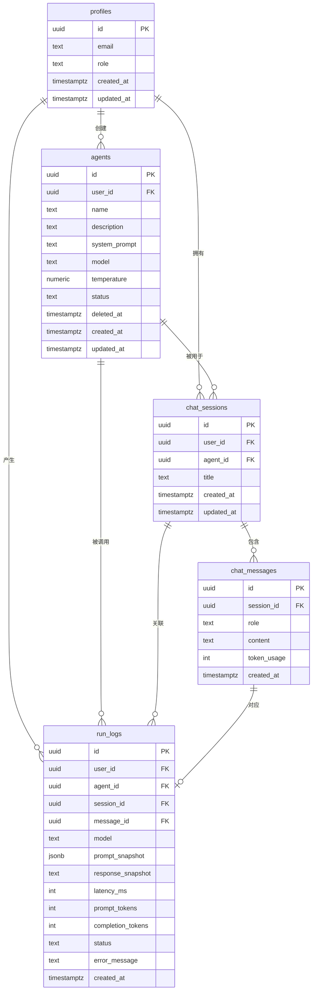

# 数据模型设计

> 本文档定义平台 MVP 阶段的完整数据模型,包括表结构、关系、约束、索引和 RLS 策略。
> 文档中的 SQL 可以直接在 Supabase SQL Editor 中执行。

## 版本

- v1.0
- 最后更新:2026-04-16

---

## 一、整体概览

### 1.1 MVP 表清单(6 张)

| 表名 | 职责 | 建表顺序 |
|---|---|---|
| `profiles` | 用户档案(扩展 auth.users) | 1 |
| `agents` | 智能体配置 | 2 |
| `chat_sessions` | 对话会话 | 3 |
| `chat_messages` | 对话消息 | 4 |
| `run_logs` | 调用日志(技术视角) | 5 |

注:PRD 里原本有 `knowledge_documents` 表,按边界决策移到 V2,MVP 不建。

### 1.2 V2 预留表(3 张,MVP 不建)

| 表名 | 职责 | 建表时机 |
|---|---|---|
| `knowledge_bases` | 知识库 | V2 |
| `documents` | 文档切片 | V2 |
| `agent_knowledge_bindings` | 智能体-文档多对多关联 | V2 |

### 1.3 ER 图



### 1.4 关系速读

- **一个用户** → 创建多个 agent、拥有多个会话、产生多条日志
- **一个 agent** → 被用于多个会话、产生多条日志
- **一个会话** → 属于一个 agent + 一个用户,包含多条消息
- **一条消息** → 属于一个会话,可能关联一条 `run_log`(只有 role='assistant' 的消息关联日志)

---

## 二、表结构详细设计

### 2.1 `profiles` 表

**职责**:扩展 Supabase 内置的 `auth.users`,存储业务相关的用户信息(角色、偏好等)。

**字段清单**:

| 字段 | 类型 | 约束 | 说明 |
|---|---|---|---|
| `id` | uuid | PK, FK → auth.users.id | 与 Auth 用户一一对应 |
| `email` | text | NOT NULL, UNIQUE | 邮箱(冗余存储,方便查询) |
| `role` | text | NOT NULL, default 'user', check ∈ ('user', 'admin') | 角色 |
| `created_at` | timestamptz | NOT NULL, default now() | 创建时间 |
| `updated_at` | timestamptz | NOT NULL, default now() | 更新时间 |

**DDL**:

```sql
CREATE TABLE profiles (
  id uuid PRIMARY KEY REFERENCES auth.users(id) ON DELETE CASCADE,
  email text NOT NULL UNIQUE,
  role text NOT NULL DEFAULT 'user' CHECK (role IN ('user', 'admin')),
  created_at timestamptz NOT NULL DEFAULT now(),
  updated_at timestamptz NOT NULL DEFAULT now()
);

COMMENT ON TABLE profiles IS '用户档案,扩展 auth.users';
COMMENT ON COLUMN profiles.role IS 'user=普通用户,admin=管理员(通过 ADMIN_EMAILS 白名单自动判定)';
```

---

### 2.2 `agents` 表

**职责**:存储用户创建的智能体配置。

**字段清单**:

| 字段 | 类型 | 约束 | 说明 |
|---|---|---|---|
| `id` | uuid | PK, default gen_random_uuid() | 主键 |
| `user_id` | uuid | FK → profiles.id, NOT NULL | 所属用户 |
| `name` | text | NOT NULL | 智能体名称 |
| `description` | text | | 描述(可选) |
| `system_prompt` | text | NOT NULL, default '' | 系统提示词 |
| `model` | text | NOT NULL | 使用的模型名(如 `deepseek-chat`) |
| `temperature` | numeric(3,2) | NOT NULL, default 0.7, check 0-2 | 温度参数 |
| `status` | text | NOT NULL, default 'draft', check | 状态 |
| `deleted_at` | timestamptz | | 软删除时间,非空表示已删除 |
| `created_at` | timestamptz | NOT NULL, default now() | 创建时间 |
| `updated_at` | timestamptz | NOT NULL, default now() | 更新时间 |

**status 取值**:`draft`(草稿)、`published`(已发布)、`disabled`(已停用)

**软删除说明**:删除 agent 时不真删,只设 `deleted_at = now()`。历史会话和日志仍可查看"该 agent 已删除"。

**DDL**:

```sql
CREATE TABLE agents (
  id uuid PRIMARY KEY DEFAULT gen_random_uuid(),
  user_id uuid NOT NULL REFERENCES profiles(id) ON DELETE CASCADE,
  name text NOT NULL,
  description text,
  system_prompt text NOT NULL DEFAULT '',
  model text NOT NULL,
  temperature numeric(3,2) NOT NULL DEFAULT 0.7 CHECK (temperature >= 0 AND temperature <= 2),
  status text NOT NULL DEFAULT 'draft' CHECK (status IN ('draft', 'published', 'disabled')),
  deleted_at timestamptz,
  created_at timestamptz NOT NULL DEFAULT now(),
  updated_at timestamptz NOT NULL DEFAULT now()
);

CREATE INDEX idx_agents_user_id ON agents(user_id) WHERE deleted_at IS NULL;
CREATE INDEX idx_agents_status ON agents(status) WHERE deleted_at IS NULL;

COMMENT ON TABLE agents IS '智能体配置';
COMMENT ON COLUMN agents.deleted_at IS '软删除,非空表示已删除,查询时需 WHERE deleted_at IS NULL';
```

---

### 2.3 `chat_sessions` 表

**职责**:对话会话,一个用户 + 一个 agent 开始一段对话。

**字段清单**:

| 字段 | 类型 | 约束 | 说明 |
|---|---|---|---|
| `id` | uuid | PK, default gen_random_uuid() | 主键 |
| `user_id` | uuid | FK → profiles.id, NOT NULL | 所属用户 |
| `agent_id` | uuid | FK → agents.id, NOT NULL | 使用的智能体 |
| `title` | text | NOT NULL, default '新对话' | 会话标题(可自动/手动命名) |
| `created_at` | timestamptz | NOT NULL, default now() | 创建时间 |
| `updated_at` | timestamptz | NOT NULL, default now() | 最后活跃时间 |

**DDL**:

```sql
CREATE TABLE chat_sessions (
  id uuid PRIMARY KEY DEFAULT gen_random_uuid(),
  user_id uuid NOT NULL REFERENCES profiles(id) ON DELETE CASCADE,
  agent_id uuid NOT NULL REFERENCES agents(id) ON DELETE RESTRICT,
  title text NOT NULL DEFAULT '新对话',
  created_at timestamptz NOT NULL DEFAULT now(),
  updated_at timestamptz NOT NULL DEFAULT now()
);

CREATE INDEX idx_sessions_user_id ON chat_sessions(user_id);
CREATE INDEX idx_sessions_agent_id ON chat_sessions(agent_id);
CREATE INDEX idx_sessions_updated_at ON chat_sessions(updated_at DESC);

COMMENT ON TABLE chat_sessions IS '对话会话';
COMMENT ON COLUMN chat_sessions.agent_id IS 'ON DELETE RESTRICT 配合 agent 软删除,保证会话不丢失';
```

**外键策略说明**:
- `user_id` 用 `CASCADE`:用户账号被删除,会话也清掉(符合隐私)
- `agent_id` 用 `RESTRICT`:配合 agent 软删除机制,历史会话不丢

---

### 2.4 `chat_messages` 表

**职责**:对话中的每条消息,用户输入和模型输出都存。

**字段清单**:

| 字段 | 类型 | 约束 | 说明 |
|---|---|---|---|
| `id` | uuid | PK, default gen_random_uuid() | 主键 |
| `session_id` | uuid | FK → chat_sessions.id, NOT NULL | 所属会话 |
| `role` | text | NOT NULL, check ∈ ('user','assistant','system') | 消息角色 |
| `content` | text | NOT NULL | 消息内容 |
| `token_usage` | int | default 0 | token 消耗(仅 assistant 消息有) |
| `created_at` | timestamptz | NOT NULL, default now() | 创建时间 |

**DDL**:

```sql
CREATE TABLE chat_messages (
  id uuid PRIMARY KEY DEFAULT gen_random_uuid(),
  session_id uuid NOT NULL REFERENCES chat_sessions(id) ON DELETE CASCADE,
  role text NOT NULL CHECK (role IN ('user', 'assistant', 'system')),
  content text NOT NULL,
  token_usage int DEFAULT 0,
  created_at timestamptz NOT NULL DEFAULT now()
);

CREATE INDEX idx_messages_session_id ON chat_messages(session_id, created_at);

COMMENT ON TABLE chat_messages IS '对话消息,session 删除时级联删除';
```

**级联删除说明**:删除 session 时自动删所有 messages(对应决策 1-A)。

---

### 2.5 `run_logs` 表

**职责**:每次模型调用的完整技术日志,用于调试、监控、管理后台。

**字段清单**:

| 字段 | 类型 | 约束 | 说明 |
|---|---|---|---|
| `id` | uuid | PK, default gen_random_uuid() | 主键 |
| `user_id` | uuid | FK → profiles.id, NOT NULL | 触发调用的用户 |
| `agent_id` | uuid | FK → agents.id, NOT NULL | 调用的智能体 |
| `session_id` | uuid | FK → chat_sessions.id | 所属会话(可空,为未来非对话场景预留) |
| `message_id` | uuid | FK → chat_messages.id | 对应的 assistant 消息 |
| `model` | text | NOT NULL | 实际调用的模型名 |
| `prompt_snapshot` | jsonb | NOT NULL | 发给模型的完整 messages 数组 |
| `response_snapshot` | text | | 模型的完整回复(失败时为空) |
| `latency_ms` | int | NOT NULL, default 0 | 请求耗时(毫秒) |
| `prompt_tokens` | int | default 0 | 输入 token 数 |
| `completion_tokens` | int | default 0 | 输出 token 数 |
| `status` | text | NOT NULL, check ∈ ('success','error','timeout','partial') | 调用状态 |
| `error_message` | text | | 错误信息(status 非 success 时) |
| `created_at` | timestamptz | NOT NULL, default now() | 创建时间 |

**status 取值**:
- `success`:正常完成
- `error`:DeepSeek 返回错误
- `timeout`:超时
- `partial`:流式中途断开,有部分响应

**DDL**:

```sql
CREATE TABLE run_logs (
  id uuid PRIMARY KEY DEFAULT gen_random_uuid(),
  user_id uuid NOT NULL REFERENCES profiles(id) ON DELETE CASCADE,
  agent_id uuid NOT NULL REFERENCES agents(id) ON DELETE RESTRICT,
  session_id uuid REFERENCES chat_sessions(id) ON DELETE SET NULL,
  message_id uuid REFERENCES chat_messages(id) ON DELETE SET NULL,
  model text NOT NULL,
  prompt_snapshot jsonb NOT NULL,
  response_snapshot text,
  latency_ms int NOT NULL DEFAULT 0,
  prompt_tokens int DEFAULT 0,
  completion_tokens int DEFAULT 0,
  status text NOT NULL CHECK (status IN ('success', 'error', 'timeout', 'partial')),
  error_message text,
  created_at timestamptz NOT NULL DEFAULT now()
);

CREATE INDEX idx_logs_user_id_created_at ON run_logs(user_id, created_at DESC);
CREATE INDEX idx_logs_status ON run_logs(status) WHERE status != 'success';
CREATE INDEX idx_logs_agent_id ON run_logs(agent_id);
CREATE INDEX idx_logs_session_id ON run_logs(session_id);

COMMENT ON TABLE run_logs IS '调用日志,技术视角,记录每次 LLM 调用的完整情况';
COMMENT ON COLUMN run_logs.prompt_snapshot IS '完整的 messages 数组 JSON,用于溯源调试';
COMMENT ON COLUMN run_logs.session_id IS 'ON DELETE SET NULL:会话删了但日志保留(用于审计)';
```

**外键策略说明**:
- `user_id` CASCADE:用户注销,日志也清
- `agent_id` RESTRICT:agent 软删除,日志保留
- `session_id`、`message_id` SET NULL:会话/消息被删时日志不丢,字段置空

---

## 三、RLS 策略设计

### 3.1 启用 RLS

```sql
ALTER TABLE profiles ENABLE ROW LEVEL SECURITY;
ALTER TABLE agents ENABLE ROW LEVEL SECURITY;
ALTER TABLE chat_sessions ENABLE ROW LEVEL SECURITY;
ALTER TABLE chat_messages ENABLE ROW LEVEL SECURITY;
ALTER TABLE run_logs ENABLE ROW LEVEL SECURITY;
```

### 3.2 辅助函数:判断是否为管理员

```sql
CREATE OR REPLACE FUNCTION is_admin()
RETURNS boolean AS $$
  SELECT EXISTS (
    SELECT 1 FROM profiles
    WHERE id = auth.uid() AND role = 'admin'
  );
$$ LANGUAGE sql STABLE SECURITY DEFINER;
```

### 3.3 `profiles` 策略

```sql
-- 用户只能查看自己的 profile;admin 可以查看所有
CREATE POLICY "profiles_select" ON profiles FOR SELECT
  USING (id = auth.uid() OR is_admin());

-- 用户可以更新自己的 profile(不含 role 字段,需额外检查)
CREATE POLICY "profiles_update" ON profiles FOR UPDATE
  USING (id = auth.uid());

-- 插入由 Trigger 完成,不开放直接插入
```

### 3.4 `agents` 策略

```sql
-- 用户只看自己的 agents(不含已删除)
CREATE POLICY "agents_select" ON agents FOR SELECT
  USING (user_id = auth.uid() AND deleted_at IS NULL);

-- 用户只能为自己创建 agent
CREATE POLICY "agents_insert" ON agents FOR INSERT
  WITH CHECK (user_id = auth.uid());

-- 用户只能更新自己的 agent
CREATE POLICY "agents_update" ON agents FOR UPDATE
  USING (user_id = auth.uid());

-- 注:删除走 UPDATE deleted_at,不走 DELETE
```

### 3.5 `chat_sessions` 策略

```sql
CREATE POLICY "sessions_select" ON chat_sessions FOR SELECT
  USING (user_id = auth.uid());

CREATE POLICY "sessions_insert" ON chat_sessions FOR INSERT
  WITH CHECK (user_id = auth.uid());

CREATE POLICY "sessions_update" ON chat_sessions FOR UPDATE
  USING (user_id = auth.uid());

CREATE POLICY "sessions_delete" ON chat_sessions FOR DELETE
  USING (user_id = auth.uid());
```

### 3.6 `chat_messages` 策略

```sql
-- 通过 session 归属判断
CREATE POLICY "messages_select" ON chat_messages FOR SELECT
  USING (
    EXISTS (
      SELECT 1 FROM chat_sessions
      WHERE chat_sessions.id = chat_messages.session_id
      AND chat_sessions.user_id = auth.uid()
    )
  );

CREATE POLICY "messages_insert" ON chat_messages FOR INSERT
  WITH CHECK (
    EXISTS (
      SELECT 1 FROM chat_sessions
      WHERE chat_sessions.id = chat_messages.session_id
      AND chat_sessions.user_id = auth.uid()
    )
  );
```

### 3.7 `run_logs` 策略

```sql
-- 普通用户看自己的,admin 看全部
CREATE POLICY "logs_select" ON run_logs FOR SELECT
  USING (user_id = auth.uid() OR is_admin());

-- 由服务端写入,不开放给客户端直接插入
-- 服务端使用 SERVICE_ROLE_KEY 绕过 RLS
```

---

## 四、Trigger 设计

### 4.1 自动更新 `updated_at`

通用 Trigger,给所有有 `updated_at` 字段的表用:

```sql
CREATE OR REPLACE FUNCTION set_updated_at()
RETURNS TRIGGER AS $$
BEGIN
  NEW.updated_at = now();
  RETURN NEW;
END;
$$ LANGUAGE plpgsql;

CREATE TRIGGER profiles_updated_at BEFORE UPDATE ON profiles
  FOR EACH ROW EXECUTE FUNCTION set_updated_at();

CREATE TRIGGER agents_updated_at BEFORE UPDATE ON agents
  FOR EACH ROW EXECUTE FUNCTION set_updated_at();

CREATE TRIGGER sessions_updated_at BEFORE UPDATE ON chat_sessions
  FOR EACH ROW EXECUTE FUNCTION set_updated_at();
```

### 4.2 用户注册自动建 profile + 判定 role

```sql
CREATE OR REPLACE FUNCTION handle_new_user()
RETURNS TRIGGER AS $$
DECLARE
  admin_list text;
  user_role text;
BEGIN
  -- 从数据库配置读取白名单
  -- 需要在 Supabase Dashboard → Database → Custom Config 里设置 app.admin_emails
  BEGIN
    admin_list := current_setting('app.admin_emails', true);
  EXCEPTION WHEN OTHERS THEN
    admin_list := '';
  END;

  IF admin_list IS NOT NULL AND NEW.email = ANY(string_to_array(admin_list, ',')) THEN
    user_role := 'admin';
  ELSE
    user_role := 'user';
  END IF;

  INSERT INTO public.profiles (id, email, role)
  VALUES (NEW.id, NEW.email, user_role);

  RETURN NEW;
END;
$$ LANGUAGE plpgsql SECURITY DEFINER;

CREATE TRIGGER on_auth_user_created
  AFTER INSERT ON auth.users
  FOR EACH ROW EXECUTE FUNCTION handle_new_user();
```

**两种管理员白名单实现方式(选一种)**:

- **方式 A**:数据库配置(如上),优点是 Trigger 自动处理
- **方式 B**:在 Next.js 注册 API 里读环境变量,登录成功后更新 `profiles.role`,优点是改白名单不用动数据库

开发时根据 Supabase 的配置便利性选择。

---

## 五、初始数据(可选)

开发期间可以插入一些测试数据方便调试:

```sql
-- 开发测试用:手动把某个邮箱设为 admin
UPDATE profiles SET role = 'admin' WHERE email = 'your-email@example.com';

-- 测试用 agent
INSERT INTO agents (user_id, name, description, system_prompt, model, temperature, status)
SELECT
  id,
  '翻译助手',
  '中英文互译',
  '你是一个专业翻译,用户发中文你译英文,反之亦然。',
  'deepseek-chat',
  0.3,
  'published'
FROM profiles WHERE email = 'your-email@example.com';
```

---

## 六、V2 预留:知识库表结构

> 以下表 MVP 阶段 **不建**,只作为 V2 开发的设计依据。
> V2 开发时直接复制这段 DDL 执行即可。

### 6.1 设计思路

- 用户先创建一个"知识库"(逻辑分组,如"公司制度"、"产品手册")
- 往知识库上传"文档"(切分后向量化存储)
- 把"智能体"和"知识库"多对多关联(一个 agent 可绑多个 KB,一个 KB 可被多 agent 用)

### 6.2 表结构

**`knowledge_bases`**:

```sql
CREATE TABLE knowledge_bases (
  id uuid PRIMARY KEY DEFAULT gen_random_uuid(),
  user_id uuid NOT NULL REFERENCES profiles(id) ON DELETE CASCADE,
  name text NOT NULL,
  description text,
  embedding_model text NOT NULL DEFAULT 'text-embedding-3-small',
  chunk_size int NOT NULL DEFAULT 500,
  deleted_at timestamptz,
  created_at timestamptz NOT NULL DEFAULT now(),
  updated_at timestamptz NOT NULL DEFAULT now()
);
```

**`documents`**:

```sql
-- 需先启用向量扩展:CREATE EXTENSION IF NOT EXISTS vector;

CREATE TABLE documents (
  id uuid PRIMARY KEY DEFAULT gen_random_uuid(),
  knowledge_base_id uuid NOT NULL REFERENCES knowledge_bases(id) ON DELETE CASCADE,
  filename text NOT NULL,
  file_path text,                              -- Supabase Storage 路径
  chunk_index int NOT NULL,                    -- 切片序号
  content text NOT NULL,                       -- 切片文本
  embedding vector(1536),                      -- 向量,维度按 embedding model 定
  status text NOT NULL DEFAULT 'processing'    -- processing/ready/error
    CHECK (status IN ('processing', 'ready', 'error')),
  error_message text,
  created_at timestamptz NOT NULL DEFAULT now()
);

CREATE INDEX idx_documents_kb ON documents(knowledge_base_id);
-- 向量索引(V2 建表时加):
-- CREATE INDEX ON documents USING ivfflat (embedding vector_cosine_ops);
```

**`agent_knowledge_bindings`**(多对多中间表):

```sql
CREATE TABLE agent_knowledge_bindings (
  agent_id uuid NOT NULL REFERENCES agents(id) ON DELETE CASCADE,
  knowledge_base_id uuid NOT NULL REFERENCES knowledge_bases(id) ON DELETE CASCADE,
  created_at timestamptz NOT NULL DEFAULT now(),
  PRIMARY KEY (agent_id, knowledge_base_id)
);
```

### 6.3 V2 阶段的 MVP 兼容说明

- V2 开发时**完全不用动现有表**,只新增 3 张表
- `agents` 表的查询逻辑加一步:LEFT JOIN `agent_knowledge_bindings` 拿绑定的知识库
- 对话逻辑加一步:如果 agent 有绑定 KB,先做向量检索,把结果拼到 system prompt

---

## 七、建表执行顺序

在 Supabase SQL Editor 里按以下顺序执行:

```
1. 启用必要扩展(如果需要)
2. 建辅助函数(is_admin, set_updated_at, handle_new_user)
3. 建表(按 profiles → agents → chat_sessions → chat_messages → run_logs 顺序)
4. 建索引
5. 建 RLS 策略
6. 启用 RLS
7. 建 Trigger
8. 插入测试数据(可选)
```

---

## 八、常用查询示例

以下是开发时会用到的典型查询,供参考:

### 8.1 查询用户的所有 agent(未删除)

```sql
SELECT * FROM agents
WHERE user_id = auth.uid() AND deleted_at IS NULL
ORDER BY updated_at DESC;
```

### 8.2 查询某会话的历史消息(用于组装上下文)

```sql
SELECT role, content FROM chat_messages
WHERE session_id = $1
ORDER BY created_at ASC
LIMIT 20;   -- MVP 按 20 条截断
```

### 8.3 管理后台:平台总览指标

```sql
-- 用户数
SELECT count(*) FROM profiles;

-- agent 总数
SELECT count(*) FROM agents WHERE deleted_at IS NULL;

-- 最近 24 小时调用数
SELECT count(*) FROM run_logs WHERE created_at > now() - interval '24 hours';

-- 失败率
SELECT
  count(*) FILTER (WHERE status != 'success') * 100.0 / count(*) as fail_rate_pct
FROM run_logs
WHERE created_at > now() - interval '24 hours';
```

### 8.4 日志页筛选(按 agent + 状态)

```sql
SELECT * FROM run_logs
WHERE user_id = auth.uid()
  AND agent_id = $1
  AND status = $2
ORDER BY created_at DESC
LIMIT 50 OFFSET $3;
```

---

## 九、后续调整记录

| 日期 | 调整内容 | 原因 |
|---|---|---|
| - | - | - |
