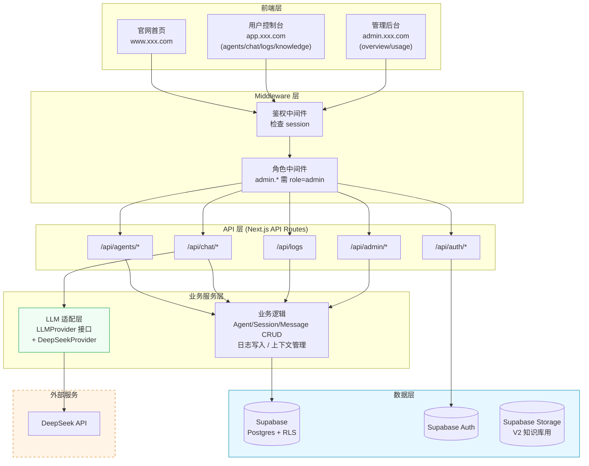
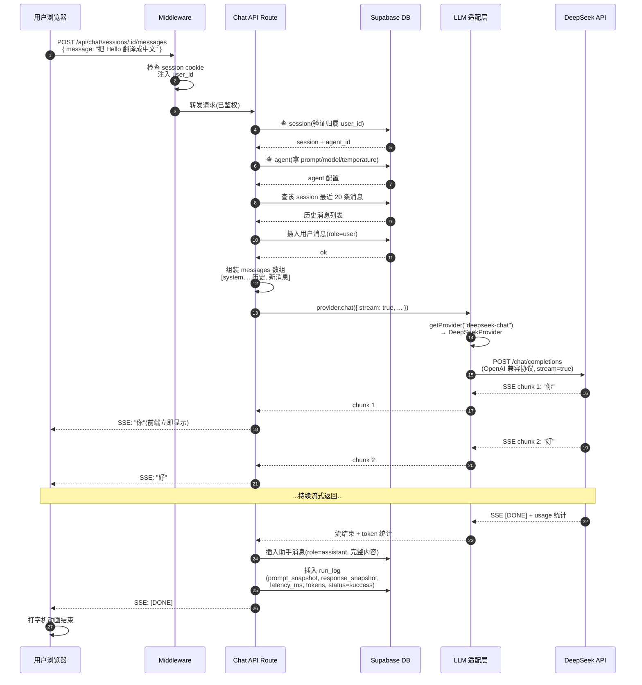
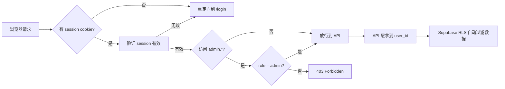

# 系统架构设计

> 本文档定义平台 MVP 阶段的整体架构、关键技术方案和核心数据流。
> 是 Claude Code 开发时的架构依据,也是理解系统如何工作的主参考。

## 版本

- v1.0
- 最后更新:2026-04-16

---

## 一、整体架构概览

### 1.1 架构分层

系统采用经典的**五层架构**,每一层职责清晰,只依赖下一层:

```
┌─────────────────────────────────────────────────────────────┐
│                       【前端层】                              │
│  用户在浏览器里看到的页面,纯静态 + 客户端交互                 │
└─────────────────────────────────────────────────────────────┘
                              ↓ HTTP 请求
┌─────────────────────────────────────────────────────────────┐
│                    【Middleware 层】                          │
│  Next.js 中间件,所有请求的第一道闸门:鉴权 + 角色校验         │
└─────────────────────────────────────────────────────────────┘
                              ↓
┌─────────────────────────────────────────────────────────────┐
│                      【API 层】                               │
│  Next.js API Routes,接收请求、参数校验、调用业务逻辑          │
└─────────────────────────────────────────────────────────────┘
                              ↓
┌─────────────────────────────────────────────────────────────┐
│                    【业务服务层】                             │
│  LLM 适配层 + 业务逻辑(CRUD、日志写入、上下文管理)           │
└─────────────────────────────────────────────────────────────┘
                              ↓
┌─────────────────────────────────────────────────────────────┐
│                   【数据与外部服务层】                        │
│  Supabase(DB/Auth/Storage) + DeepSeek API                   │
└─────────────────────────────────────────────────────────────┘
```

### 1.2 分层架构图(Mermaid)



### 1.3 各层职责说明

| 层 | 职责 | 对应技术 |
|---|---|---|
| 前端层 | 用户界面、交互、本地状态 | Next.js App Router + React + Tailwind + shadcn/ui |
| Middleware 层 | 鉴权拦截、角色校验、重定向 | Next.js Middleware |
| API 层 | HTTP 接口、参数校验、错误处理 | Next.js API Routes |
| 业务服务层 | 业务逻辑、模型调用适配、日志记录 | TypeScript 模块 |
| 数据层 | 数据持久化、用户认证、文件存储 | Supabase(Postgres + Auth + Storage) |
| 外部服务 | LLM 推理 | DeepSeek API |

### 1.4 几个关键设计决策

**① 为什么把 LLM 适配层单独画出来?**
它是架构的"扩展点"——未来要接 OpenAI、智谱、Moonshot 都只改这一层,业务代码完全不动。把它单独画出来是在强调"这是一个边界,是隔离变化的地方"。

**② 为什么 Middleware 层要独立画?**
所有请求都要过鉴权,这是**横切关注点**(cross-cutting concern)。单独画一层是为了表达"鉴权不属于任何具体业务,是所有业务的公共前置"。

**③ 为什么外部服务用虚线框?**
`DeepSeek API` 是我们不能控制的服务(可能宕机、可能改接口、可能涨价)。架构图上用不同样式标记出"外部依赖"能帮助后续识别系统的**故障点**和**扩展点**。

**④ MVP 阶段 Supabase Storage 画了但不用?**
Supabase Storage 是 V2 知识库的文件存储用的。MVP 阶段不用,但画出来是为了展示"基础设施已经齐全,V2 不用换技术栈"。

---

## 二、核心数据流:一次"发消息"的完整链路

这是平台最核心、最复杂的一条数据流。理解这张图等于理解了整个系统的运作方式。

### 2.1 场景描述

用户场景:
1. 用户 Alice 已登录
2. Alice 已创建并"发布"了一个 agent(名为"翻译助手",模型 DeepSeek-chat,温度 0.7)
3. Alice 在对话页选中"翻译助手",开始了新会话
4. Alice 输入"把 Hello 翻译成中文",点击发送

系统要做什么:
- 验证 Alice 的身份和权限
- 读取 agent 配置 + 历史消息(多轮上下文)
- 调用 DeepSeek API(流式)
- 把回复实时返回给前端(打字机效果)
- 全过程结束后把消息和日志落库

### 2.2 完整数据流图



### 2.3 关键步骤讲解

**步骤 1-3:Middleware 鉴权**
- Middleware 从 cookie 里读 Supabase session
- 没登录 → 直接 401 返回,不进入 API
- 有登录 → 把 user_id 注入到请求上下文,API 可以直接用

**步骤 4-9:上下文组装**
- 先查 session 确认归属(Alice 不能给别人的 session 发消息)
- 再查 agent 拿到 Prompt 和模型参数
- 再查历史消息,用于组成多轮对话的上下文
- 用户消息提前入库(即使后续调模型失败,用户消息也不丢)

**步骤 10-11:调用适配层**
- 业务代码不关心"要调哪家模型",只调 `provider.chat()`
- 适配层根据 `model` 字段决定用哪个 Provider

**步骤 12-14:流式调用**
- DeepSeekProvider 按 OpenAI 兼容协议调用 DeepSeek
- 设置 `stream: true`,返回 AsyncIterable

**步骤 15-20:SSE 流转**
- DeepSeek 每吐一个 token,适配层立即透传
- API Route 立即通过 SSE 发给浏览器
- 浏览器立即显示(打字机效果)
- 整个过程"边生成边看",用户体验极好

**步骤 21-23:收尾落库**
- 流结束后,完整内容写入 `chat_messages`
- 同时写入 `run_logs`(包含完整 prompt 快照 + 响应 + 耗时 + token)
- 最后发 `[DONE]` 信号告诉前端结束

### 2.4 失败场景处理

| 失败点 | 处理方式 |
|---|---|
| DeepSeek API 超时 | 写 `run_logs` 状态为 `timeout`,前端显示"模型响应超时" |
| DeepSeek API 报错 | 写 `run_logs` 状态为 `error`,记录 error_message |
| 流式中途断开 | 已接收部分仍写入 message,标记为 `partial` |
| Token 超限 | 上下文组装阶段就截断,不应到模型层 |

---

## 三、LLM 适配层详细设计

### 3.1 设计目标

- **业务代码与具体模型解耦**:`/api/chat` 不关心底层是 DeepSeek 还是 OpenAI
- **未来可轻易扩展**:加新模型 = 新增一个 Provider 类
- **统一错误处理和超时控制**:各供应商的错误码和异常都归一化
- **同时支持流式和非流式**:同一个接口两种调用方式

### 3.2 接口定义

```typescript
// lib/llm/types.ts

export type Role = 'system' | 'user' | 'assistant'

export interface Message {
  role: Role
  content: string
}

export interface ChatParams {
  model: string
  messages: Message[]
  temperature?: number
  maxTokens?: number
  stream?: boolean
}

export interface ChatResponse {
  content: string
  usage: {
    promptTokens: number
    completionTokens: number
    totalTokens: number
  }
  finishReason: 'stop' | 'length' | 'error'
}

export interface ChatChunk {
  delta: string          // 本次增量内容
  done: boolean          // 是否是最后一块
  usage?: ChatResponse['usage']  // 只在 done=true 时有
}

export interface LLMProvider {
  chat(params: ChatParams & { stream: false }): Promise<ChatResponse>
  chat(params: ChatParams & { stream: true }): AsyncIterable<ChatChunk>
}
```

### 3.3 DeepSeekProvider 实现骨架

```typescript
// lib/llm/providers/deepseek.ts

export class DeepSeekProvider implements LLMProvider {
  private apiKey = process.env.DEEPSEEK_API_KEY!
  private baseUrl = 'https://api.deepseek.com/v1'

  async *chat(params: ChatParams) {
    const response = await fetch(`${this.baseUrl}/chat/completions`, {
      method: 'POST',
      headers: {
        'Authorization': `Bearer ${this.apiKey}`,
        'Content-Type': 'application/json',
      },
      body: JSON.stringify({
        model: params.model,
        messages: params.messages,
        temperature: params.temperature ?? 0.7,
        stream: params.stream,
      }),
      signal: AbortSignal.timeout(60_000),  // 60 秒超时
    })

    if (!response.ok) {
      throw new LLMError(`DeepSeek API error: ${response.status}`)
    }

    if (params.stream) {
      // 解析 SSE 流,yield ChatChunk
      yield* parseSSEStream(response.body!)
    } else {
      // 返回完整响应
      const data = await response.json()
      return normalizeResponse(data)
    }
  }
}
```

### 3.4 工厂函数

```typescript
// lib/llm/index.ts

export function getProvider(model: string): LLMProvider {
  if (model.startsWith('deepseek-')) {
    return new DeepSeekProvider()
  }
  // 未来扩展:
  // if (model.startsWith('gpt-')) return new OpenAIProvider()
  // if (model.startsWith('glm-')) return new ZhipuProvider()
  throw new Error(`Unsupported model: ${model}`)
}
```

### 3.5 业务层调用示例

```typescript
// app/api/chat/sessions/[id]/messages/route.ts

import { getProvider } from '@/lib/llm'

const provider = getProvider(agent.model)
const stream = provider.chat({
  model: agent.model,
  messages: [
    { role: 'system', content: agent.system_prompt },
    ...historyMessages,
    { role: 'user', content: userMessage },
  ],
  temperature: agent.temperature,
  stream: true,
})

for await (const chunk of stream) {
  // 透传给前端 SSE
}
```

### 3.6 扩展路径

当未来需要接新模型时,只需要:
1. 新建 `lib/llm/providers/xxx.ts` 实现 `LLMProvider`
2. 在 `getProvider` 工厂函数里加一个分支
3. 在 agents 配置页的模型下拉里加选项

业务代码(API Route、前端)一行不改。

---

## 四、鉴权与权限控制设计

### 4.1 整体流程



### 4.2 三层防护

**第一层:Middleware(页面/API 前置)**
- 所有 `app.*/admin.*` 路径都过
- 检查 session 是否有效
- 检查 admin 角色
- 不通过就重定向或拒绝

**第二层:API Route(业务前置)**
- API 从 Middleware 注入的上下文拿 `user_id`
- 所有查询/写入都带上 `user_id` 作为筛选条件
- 不信任前端传来的 `user_id`

**第三层:Supabase RLS(数据库级兜底)**
- 即使 API 层忘记加 `user_id` 筛选,RLS 也会自动过滤
- 这是数据安全的最后一道保险

### 4.3 RLS 策略示例

```sql
-- agents 表:用户只能看自己的
CREATE POLICY "Users can view own agents"
  ON agents FOR SELECT
  USING (auth.uid() = user_id);

CREATE POLICY "Users can insert own agents"
  ON agents FOR INSERT
  WITH CHECK (auth.uid() = user_id);

-- run_logs 表:用户看自己的,admin 看全部
CREATE POLICY "Users see own logs, admin sees all"
  ON run_logs FOR SELECT
  USING (
    auth.uid() = user_id
    OR
    (SELECT role FROM profiles WHERE id = auth.uid()) = 'admin'
  );
```

### 4.4 白名单管理员机制

**流程**:
1. 用户注册(Supabase Auth 创建 auth.users 记录)
2. Database Trigger 触发,自动在 `profiles` 表插入记录
3. Trigger 检查该用户邮箱是否在环境变量 `ADMIN_EMAILS` 里
4. 在 → `role = 'admin'`,不在 → `role = 'user'`

**Trigger 示例**:

```sql
CREATE OR REPLACE FUNCTION handle_new_user()
RETURNS TRIGGER AS $$
DECLARE
  admin_emails TEXT;
  is_admin BOOLEAN;
BEGIN
  -- 从配置表或环境读取白名单
  admin_emails := current_setting('app.admin_emails', true);
  is_admin := NEW.email = ANY(string_to_array(admin_emails, ','));

  INSERT INTO public.profiles (id, email, role)
  VALUES (
    NEW.id,
    NEW.email,
    CASE WHEN is_admin THEN 'admin' ELSE 'user' END
  );

  RETURN NEW;
END;
$$ LANGUAGE plpgsql SECURITY DEFINER;

CREATE TRIGGER on_auth_user_created
  AFTER INSERT ON auth.users
  FOR EACH ROW EXECUTE FUNCTION handle_new_user();
```

> 注:Supabase 的 `current_setting` 方式需要在项目配置里设置 `app.admin_emails`。
> 另一种更简单的做法:把白名单判定逻辑放在 Next.js 的注册 API 里,登录后立即更新 role。两种都行,后续实现时选一种。

---

## 五、SSE 流式输出技术方案

### 5.1 为什么用 SSE 不用 WebSocket

| 对比项 | SSE | WebSocket |
|---|---|---|
| 方向 | 服务端 → 客户端(单向) | 双向 |
| 协议 | 基于 HTTP | 独立协议 |
| 浏览器支持 | 原生 `EventSource` | 原生 `WebSocket` |
| 断线重连 | 浏览器自动 | 需手动实现 |
| 对话场景适用 | ✅ 非常契合(模型吐一个字就推一个字) | 可以但过重 |
| Vercel 部署 | ✅ 完美支持 | ⚠️ 有限制 |

**结论**:对话的流式输出天然是单向"服务端推客户端",SSE 是最契合的方案。

### 5.2 后端实现(Next.js API Route)

```typescript
// app/api/chat/sessions/[id]/messages/route.ts

export async function POST(req: Request, { params }) {
  // ...前置逻辑...

  const encoder = new TextEncoder()

  const stream = new ReadableStream({
    async start(controller) {
      try {
        const provider = getProvider(agent.model)
        let fullResponse = ''

        for await (const chunk of provider.chat({
          model: agent.model,
          messages,
          temperature: agent.temperature,
          stream: true,
        })) {
          fullResponse += chunk.delta

          // SSE 格式:data: {json}\n\n
          controller.enqueue(
            encoder.encode(`data: ${JSON.stringify({ delta: chunk.delta })}\n\n`)
          )

          if (chunk.done) {
            // 流结束,落库
            await saveMessage(fullResponse)
            await saveLog(...)
            controller.enqueue(encoder.encode(`data: [DONE]\n\n`))
          }
        }
      } catch (error) {
        controller.enqueue(
          encoder.encode(`data: ${JSON.stringify({ error: error.message })}\n\n`)
        )
        await saveLog({ status: 'error', error_message: error.message })
      } finally {
        controller.close()
      }
    },
  })

  return new Response(stream, {
    headers: {
      'Content-Type': 'text/event-stream',
      'Cache-Control': 'no-cache',
      'Connection': 'keep-alive',
    },
  })
}
```

### 5.3 前端实现(两种方案)

**方案 A:Vercel AI SDK(强烈推荐)**

```typescript
import { useChat } from 'ai/react'

function ChatPage() {
  const { messages, input, handleSubmit, isLoading } = useChat({
    api: `/api/chat/sessions/${sessionId}/messages`,
  })
  // 几行代码就搞定了打字机、消息管理、错误处理
}
```

**方案 B:手动实现(理解原理用)**

```typescript
async function sendMessage(content: string) {
  const response = await fetch(`/api/chat/sessions/${id}/messages`, {
    method: 'POST',
    body: JSON.stringify({ message: content }),
  })

  const reader = response.body!.getReader()
  const decoder = new TextDecoder()
  let assistantMessage = ''

  while (true) {
    const { done, value } = await reader.read()
    if (done) break

    const text = decoder.decode(value)
    const lines = text.split('\n').filter(l => l.startsWith('data: '))

    for (const line of lines) {
      const data = line.slice(6)
      if (data === '[DONE]') return
      const { delta } = JSON.parse(data)
      assistantMessage += delta
      setMessages(prev => [...prev.slice(0, -1), { ...last, content: assistantMessage }])
    }
  }
}
```

### 5.4 Vercel 部署注意事项

- Next.js 的 API Route 在 Vercel 上默认运行在 Serverless Function,**流式输出需要使用 Edge Runtime 或设置 `maxDuration`**
- 建议在 route.ts 里加:
  ```typescript
  export const runtime = 'nodejs'        // 或 'edge'
  export const maxDuration = 60           // 最大 60 秒(Vercel Hobby 版上限)
  ```
- 长对话(超过 60s)需要用 Edge Runtime 或升级 Vercel 计划

---

## 六、技术栈依赖全览

### 6.1 必装依赖

```json
{
  "dependencies": {
    "next": "^14.x",
    "react": "^18.x",
    "@supabase/supabase-js": "^2.x",
    "@supabase/ssr": "^0.x",
    "ai": "^3.x",                    // Vercel AI SDK
    "tailwindcss": "^3.x",
    "class-variance-authority": "^0.x",   // shadcn 依赖
    "clsx": "^2.x",
    "lucide-react": "^0.x",
    "react-markdown": "^9.x"          // 消息 Markdown 渲染
  }
}
```

### 6.2 环境变量清单

```bash
# Supabase
NEXT_PUBLIC_SUPABASE_URL=
NEXT_PUBLIC_SUPABASE_ANON_KEY=
SUPABASE_SERVICE_ROLE_KEY=            # 仅服务端用,绕过 RLS

# DeepSeek
DEEPSEEK_API_KEY=

# 管理员白名单
ADMIN_EMAILS=admin1@example.com,admin2@example.com

# 站点
NEXT_PUBLIC_SITE_URL=http://localhost:3000
```

---

## 七、开发时的架构实践检查点

开发过程中遇到选择题时,回头对照这些原则:

1. **业务代码绝对不能直接调 DeepSeek API**,必须通过 `getProvider()`
2. **所有 DB 查询必须依赖 RLS**,不要在代码里自己拼 `WHERE user_id = ?`
3. **Middleware 不处理业务**,只做鉴权和重定向
4. **API Route 只做参数校验和编排**,业务逻辑放在 `lib/` 下的模块里
5. **前端组件不直接调 Supabase**,通过自己的 API Route 走一遍(便于后续加业务逻辑)
6. **日志一定在 API 层写**,不要下沉到适配层(适配层对业务无感知)

---

## 附录 A:目录结构建议

```
my-agent-platform/
├── app/
│   ├── (marketing)/              # 官网
│   │   └── page.tsx
│   ├── (app)/                    # 用户控制台
│   │   ├── login/
│   │   ├── agents/
│   │   ├── chat/
│   │   ├── knowledge/            # V2 占位页
│   │   └── logs/
│   ├── (admin)/                  # 管理后台
│   │   └── admin/
│   └── api/
│       ├── auth/
│       ├── agents/
│       ├── chat/
│       ├── logs/
│       └── admin/
├── components/
│   ├── ui/                       # shadcn 组件
│   ├── agents/
│   ├── chat/
│   └── logs/
├── lib/
│   ├── supabase/                 # Supabase 客户端封装
│   │   ├── server.ts
│   │   └── client.ts
│   ├── llm/                      # LLM 适配层
│   │   ├── types.ts
│   │   ├── providers/
│   │   │   └── deepseek.ts
│   │   └── index.ts              # getProvider 工厂
│   └── utils/
├── middleware.ts
├── docs/                         # 项目文档
└── types/                        # TypeScript 类型
```
