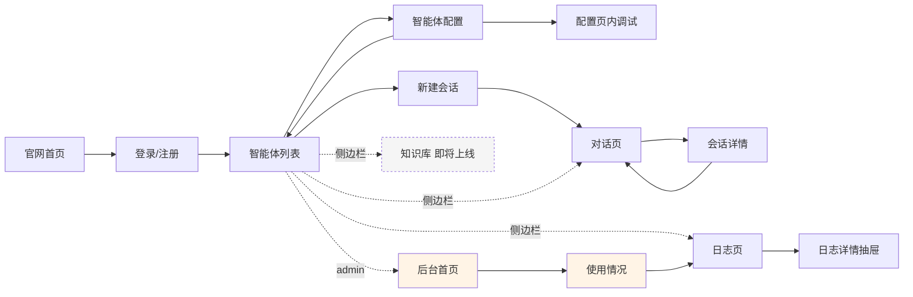

# 页面架构设计

> 本文档定义平台所有页面的线框结构、布局方案、组件清单和交互行为。
> 是 Claude Code 开发前端页面时的直接参考。

## 版本

- v1.0
- 最后更新:2026-04-16

---

## 一、整体布局策略

### 1.1 三套子域,三种布局

| 子域 | 布局特征 | 视觉基调 |
|---|---|---|
| `www.xxx.com`(官网) | 全屏营销页,中心对齐 | 品牌化,留白多 |
| `app.xxx.com`(用户控制台) | 左侧导航 + 主内容区 | 工具感,信息密度适中 |
| `admin.xxx.com`(管理后台) | 左侧导航 + 主内容区(独立配色) | 仪表盘感,区分于用户侧 |

### 1.2 三个布局模板

```
┌──────────── 官网布局 (MarketingLayout) ────────────┐
│  Logo          导航          登录/注册 CTA          │
│ ─────────────────────────────────────────────────── │
│                                                     │
│              营销内容(全宽,中心对齐)                │
│                                                     │
└─────────────────────────────────────────────────────┘

┌──────────── 控制台布局 (AppLayout) ─────────────────┐
│  Logo                  面包屑         Email / 退出    │
│ ────┬───────────────────────────────────────────── │
│     │                                              │
│ 导航 │                                              │
│ 栏  │              主内容区                         │
│     │                                              │
│     │                                              │
└─────┴──────────────────────────────────────────────┘

┌──────────── 后台布局 (AdminLayout) ─────────────────┐
│  [Admin] Logo           "管理后台"        Email       │
│ ────┬───────────────────────────────────────────── │
│     │                                              │
│ 导航 │         主内容区(仪表盘风格)                  │
│     │                                              │
└─────┴──────────────────────────────────────────────┘
```

### 1.3 用户控制台侧边栏

```
┌──────────────┐
│ 🤖 智能体     │  → /agents
│ 💬 对话       │  → /chat
│ 📚 知识库     │  → /knowledge (标"即将上线")
│ 📋 日志       │  → /logs
└──────────────┘
```

### 1.4 管理后台侧边栏

```
┌──────────────┐
│ 📊 概览       │  → /admin
│ 📈 使用情况   │  → /admin/usage
└──────────────┘
```

---

## 二、页面详细设计

### 2.1 官网首页(1/10)

**路径**:`www.xxx.com/`
**布局模板**:MarketingLayout
**鉴权**:无需登录

**线框结构**:

```
┌──────────────────────────────────────────────────────┐
│  [Logo] 智能体平台           [登录] [立即开始 →]       │
├──────────────────────────────────────────────────────┤
│                                                      │
│              5 分钟搭建你的专属智能体                  │
│       基于 DeepSeek 的最小可用智能体编排平台           │
│                                                      │
│              [免费注册 →]   [查看文档]                │
│                                                      │
├──────────────────────────────────────────────────────┤
│  核心能力                                            │
│  ┌──────────┐  ┌──────────┐  ┌──────────┐          │
│  │ 🤖 创建   │  │ 💬 对话   │  │ 📋 可观测 │          │
│  │ 智能体   │  │ 调试      │  │ 日志      │          │
│  └──────────┘  └──────────┘  └──────────┘          │
├──────────────────────────────────────────────────────┤
│  Footer:版权 · 文档 · 联系                           │
└──────────────────────────────────────────────────────┘
```

**关键区域**:
1. **顶部导航**:Logo + 登录/CTA
2. **Hero 区**:一句话价值主张 + 主 CTA
3. **能力展示**:3 个核心能力卡片
4. **Footer**:简单页脚

**组件清单**:
- `Logo`、`Button`、`FeatureCard`

**MVP 实现建议**:P1 优先级,先做一屏简版,后期再丰富。

---

### 2.2 登录/注册页(2/10)

**路径**:`app.xxx.com/login`
**布局模板**:独立布局(无导航)
**鉴权**:未登录才可访问

**线框结构**:

```
┌──────────────────────────────────────────────────────┐
│                                                      │
│                    [Logo]                            │
│                                                      │
│       ┌────────────────────────────┐                 │
│       │  登录  |  注册              │ ← Tab 切换     │
│       ├────────────────────────────┤                 │
│       │                            │                 │
│       │  邮箱                       │                 │
│       │  [                       ] │                 │
│       │                            │                 │
│       │  密码                       │                 │
│       │  [                       ] │                 │
│       │                            │                 │
│       │  [      登录      ]         │                 │
│       │                            │                 │
│       │  ─── 或 ───(V2 预留)        │                 │
│       │  [Google 登录](V2)          │                 │
│       └────────────────────────────┘                 │
│                                                      │
└──────────────────────────────────────────────────────┘
```

**关键交互**:
- Tab 切换"登录 / 注册",同页表单不同提交逻辑
- 登录成功 → 重定向到 `/agents`
- 注册成功 → 自动登录 → 重定向到 `/agents`
- 错误提示用 Toast 或表单下方红字

**组件清单**:
- `AuthCard`(卡片容器)
- `Tabs`(登录/注册切换)
- `Input`、`Button`、`FormField`

**MVP 要求**:P0,第一批实现。

---

### 2.3 智能体列表页(3/10)

**路径**:`app.xxx.com/agents`
**布局模板**:AppLayout(侧边栏高亮"智能体")
**鉴权**:登录用户

**线框结构**:

```
┌──────────────────────────────────────────────────────┐
│  面包屑:智能体                          [+ 创建智能体]│
├──────────────────────────────────────────────────────┤
│  搜索框                    状态筛选 ▾   排序 ▾        │
│  [ 🔍              ]      [全部 ▾]    [最近修改 ▾]  │
├──────────────────────────────────────────────────────┤
│  ┌─────────────────┐  ┌─────────────────┐           │
│  │ 🤖 翻译助手      │  │ 🤖 客服助手      │           │
│  │ 中英文互译       │  │ 回答常见问题     │           │
│  │ [已发布]         │  │ [草稿]           │           │
│  │ deepseek-chat    │  │ deepseek-chat    │           │
│  │ 修改于 2 小时前  │  │ 修改于昨天       │           │
│  │ ────────────────│  │ ────────────────│           │
│  │ [配置] [对话]    │  │ [配置] [对话]    │           │
│  └─────────────────┘  └─────────────────┘           │
│                                                      │
│  ┌─────────────────┐                                │
│  │ + 创建新智能体   │                                │
│  │                 │                                │
│  └─────────────────┘                                │
└──────────────────────────────────────────────────────┘
```

**关键区域**:
1. **顶部操作栏**:右上角"创建智能体"按钮
2. **筛选区**:搜索框 + 状态筛选 + 排序
3. **卡片网格**:智能体卡片 + 末尾"创建新"卡片
4. **空状态**:无智能体时显示引导创建的大图 + CTA

**卡片内容**:
- 图标 + 名称 + 描述
- 状态徽章(draft/published/disabled)
- 模型标签
- 最后修改时间
- 操作按钮(配置 / 对话 / 更多)

**"创建智能体"对话框**:

```
┌──────────────────────────────────┐
│  创建智能体                    ✕ │
├──────────────────────────────────┤
│  名称 *                          │
│  [                            ]  │
│                                  │
│  描述(可选)                     │
│  [                            ]  │
│  [                            ]  │
│                                  │
│             [取消]  [创建]        │
└──────────────────────────────────┘
```

创建后自动跳转到 `/agents/:id` 配置页。

**组件清单**:
- `AgentCard`
- `CreateAgentDialog`
- `FilterBar`
- `EmptyState`

**MVP 要求**:P0,第一批实现。

---

### 2.4 智能体配置页(4/10)

**路径**:`app.xxx.com/agents/:id`
**布局模板**:AppLayout
**鉴权**:登录用户 + 归属检查

**设计思路**:借鉴 Dify 的"左配置 + 右预览"双栏布局。

**线框结构**:

```
┌──────────────────────────────────────────────────────┐
│ 面包屑:智能体 › 翻译助手    [草稿▾]  [删除] [保存]   │
├──────────────────────────┬───────────────────────────┤
│ ┌─ 基本信息 ────────────┐│ ┌─ 调试对话 ────────────┐ │
│ │ 名称                  ││ │                       │ │
│ │ [翻译助手           ] ││ │ 👤: 你好              │ │
│ │                       ││ │ 🤖: Hello!            │ │
│ │ 描述                  ││ │                       │ │
│ │ [中英文互译        ] ││ │                       │ │
│ └───────────────────────┘│ │                       │ │
│                          │ │                       │ │
│ ┌─ Prompt ──────────────┐│ │                       │ │
│ │ 系统提示词             ││ │                       │ │
│ │ ┌───────────────────┐ ││ │                       │ │
│ │ │ 你是一个专业翻译...│ ││ │                       │ │
│ │ │                   │ ││ │                       │ │
│ │ │                   │ ││ │                       │ │
│ │ └───────────────────┘ ││ │                       │ │
│ └───────────────────────┘│ │                       │ │
│                          │ │ ─────────────────────│ │
│ ┌─ 模型参数 ────────────┐│ │ [试一下...         ]▸│ │
│ │ 模型                  ││ │                       │ │
│ │ [deepseek-chat    ▾] ││ │ ⓘ 保存后才能正式对话  │ │
│ │                       ││ └───────────────────────┘ │
│ │ 温度 (0-2)            ││                           │
│ │ ○──────●──────── 0.7  ││                           │
│ └───────────────────────┘│                           │
└──────────────────────────┴───────────────────────────┘
```

**关键区域**:

1. **顶部栏**:
 - 左:面包屑
 - 右:状态切换下拉(草稿/已发布/已停用)、删除、保存

2. **左侧配置区(约 60% 宽度)**:
 - **基本信息**:名称、描述
 - **Prompt**:大尺寸 textarea,支持快捷键 Cmd+S 保存
 - **模型参数**:模型下拉(只列 DeepSeek 模型)、温度滑块

3. **右侧调试区(约 40% 宽度)**:
 - 小型对话窗口,用于立即测试 Prompt 效果
 - 只存在于本页面,不写入正式 chat_sessions
 - 显示"保存后才能正式对话"提示

**关键交互**:
- **未保存变更提示**:修改后"保存"按钮高亮,尝试离开页面弹确认
- **状态切换**:切换到"已发布"时校验必填项(名称、Prompt 不为空)
- **删除**:二次确认弹窗,说明"删除后历史会话仍可查看,但无法新建会话"
- **调试对话**:使用当前**未保存**的配置即时试调(用本地 state 而非 agent 记录)

**组件清单**:
- `AgentConfigForm`(左侧)
- `AgentDebugPanel`(右侧调试区)
- `StatusSelect`
- `ModelSelect`
- `TemperatureSlider`
- `DeleteConfirmDialog`

**MVP 要求**:P0,是平台的核心配置页。

---

### 2.5 对话页(5/10)

**路径**:`app.xxx.com/chat`
**布局模板**:AppLayout(但主内容区占满)
**鉴权**:登录用户

**设计思路**:经典"左会话列表 + 右消息区"双栏。

**线框结构**:

```
┌──────────────────────────────────────────────────────┐
│  面包屑:对话                    [+ 新建会话]          │
├──────┬───────────────────────────────────────────────┤
│      │  当前:🤖 翻译助手                             │
│ 搜索  │  [切换智能体 ▾]                               │
│ [🔍] ├───────────────────────────────────────────────┤
│      │                                               │
│ 今天 │                                               │
│ ┌──┐ │  👤 你                                        │
│ │翻译│ │  把 Hello 翻译成中文                          │
│ │测试│ │                                               │
│ └──┘ │                                               │
│ ┌──┐ │  🤖 翻译助手                                   │
│ │代码│ │  你好(Hello 的中文翻译)                     │
│ │问题│ │                                               │
│ └──┘ │                                               │
│      │  ...                                          │
│ 昨天 │                                               │
│ ┌──┐ │                                               │
│ │...│ │                                               │
│ └──┘ ├───────────────────────────────────────────────┤
│      │  [输入消息... Enter 发送, Shift+Enter 换行]   │
│      │  [📎(V2)]                          [发送 ▸]  │
└──────┴───────────────────────────────────────────────┘
```

**关键区域**:

1. **左侧会话列表(约 260px)**:
 - 顶部:搜索框
 - 按时间分组(今天/昨天/更早)
 - 每项:标题 + 智能体名 + 最后消息时间
 - hover 显示"重命名 / 删除"小菜单

2. **右侧对话区**:
 - 顶部:当前智能体标识 + 切换按钮
 - 中间:消息流(滚动区)
 - 底部:输入框

3. **消息气泡**:
 - 用户消息:右对齐,浅色背景
 - 助手消息:左对齐,带智能体图标
 - Markdown 渲染(代码块、列表、粗体等)
 - 流式输出时显示"正在输入..."动画 → 边生成边显示

4. **空状态**(未选择会话时):

```
┌─────────────────────────────────────┐
│                                     │
│           🤖                        │
│     开始你的第一次对话               │
│                                     │
│   [+ 新建会话]                      │
│                                     │
└─────────────────────────────────────┘
```

**关键交互**:
- **新建会话**:弹出智能体选择器(只列 published 状态的)→ 创建 session → 跳转 `/chat/:id`
- **切换智能体**:当前会话内不能换(每个会话绑定一个 agent),要换就新建会话
- **流式输出**:边收边显示,收完后启用输入框
- **回车发送**:Enter 发送,Shift+Enter 换行
- **发送中状态**:输入框禁用,发送按钮变"停止"(MVP 可先不做停止)
- **自动命名**:第一条消息发完后,用前 20 字更新 session.title

**组件清单**:
- `ChatLayout`(双栏容器)
- `SessionList`、`SessionListItem`
- `MessageBubble`、`UserMessage`、`AssistantMessage`
- `ChatInput`
- `AgentSelector`
- `TypingIndicator`(流式动画)
- `MarkdownRenderer`

**MVP 要求**:P0,是平台的核心体验页。开发工作量最大。

---

### 2.6 会话详情页(6/10)

**路径**:`app.xxx.com/chat/:id`
**布局模板**:AppLayout
**鉴权**:登录用户 + 归属检查

**设计说明**:
这个页面和 `/chat` 共用布局,区别是**左侧会话列表中该会话高亮,右侧直接加载该会话的历史消息**。

实际实现上通常就是 `/chat` 页面的路由参数版本,UI 完全一致,只是加载对应 session 的数据。

**URL 行为**:
- `/chat` → 空状态或默认打开最近会话
- `/chat/abc123` → 打开指定 session

**特殊操作**:
- 会话顶部有"重命名"入口
- "删除会话"入口(带二次确认)

**MVP 要求**:P0,与 `/chat` 同批实现。

---

### 2.7 知识库页(7/10)

**路径**:`app.xxx.com/knowledge`
**布局模板**:AppLayout
**鉴权**:登录用户

**MVP 状态**:占位页,显示"即将上线"

**线框结构**:

```
┌──────────────────────────────────────────────────────┐
│  面包屑:知识库                                       │
├──────────────────────────────────────────────────────┤
│                                                      │
│                                                      │
│                     📚                               │
│                                                      │
│              知识库功能即将上线                        │
│                                                      │
│   很快你就能上传文档,让智能体基于你的专属知识回答    │
│                                                      │
│              [了解更多 →]                             │
│                                                      │
│                                                      │
└──────────────────────────────────────────────────────┘
```

**侧边栏标注**:知识库项旁显示"Soon"徽章。

**MVP 要求**:P0(占位),V2 实装。

---

### 2.8 日志页(8/10)

**路径**:`app.xxx.com/logs`
**布局模板**:AppLayout
**鉴权**:登录用户(只看自己的)

**线框结构**:

```
┌──────────────────────────────────────────────────────┐
│  面包屑:日志                                         │
├──────────────────────────────────────────────────────┤
│  筛选:                                               │
│  状态[全部▾]  智能体[全部▾]  时间[近 7 天▾]  [重置]│
├──────────────────────────────────────────────────────┤
│ ┌────────────────────────────────────────────────┐ │
│ │ 时间       | 智能体 | 模型       | 耗时  |Token|状态│ │
│ ├────────────────────────────────────────────────┤ │
│ │ 10:23:45   │翻译助手│deepseek-chat│1.2s │ 156 │✅│ │
│ │ 10:20:12   │翻译助手│deepseek-chat│2.8s │ 342 │✅│ │
│ │ 10:15:33   │客服助手│deepseek-chat│  -  │  0  │❌│ │
│ │ 09:48:22   │翻译助手│deepseek-chat│1.0s │ 98  │✅│ │
│ │ ...                                            │ │
│ └────────────────────────────────────────────────┘ │
│                                                      │
│                     [上一页]  1/12  [下一页]          │
└──────────────────────────────────────────────────────┘
```

**点击一行 → 右侧滑出详情抽屉**:

```
                          ┌──────────────────────┐
                          │  调用详情          ✕ │
                          ├──────────────────────┤
                          │  时间:10:15:33      │
                          │  智能体:客服助手    │
                          │  模型:deepseek-chat │
                          │  状态:❌ 错误       │
                          │  错误:API timeout   │
                          ├──────────────────────┤
                          │  ▾ Prompt 快照       │
                          │  ┌──────────────┐   │
                          │  │ [             │   │
                          │  │   {role:"sys"..│   │
                          │  │   {role:"user"│   │
                          │  │ ]             │   │
                          │  └──────────────┘   │
                          ├──────────────────────┤
                          │  ▾ 响应              │
                          │  (此次调用无响应)    │
                          └──────────────────────┘
```

**关键区域**:
1. **筛选区**:状态 / 智能体 / 时间范围 / 重置
2. **日志表格**:时间、智能体、模型、耗时、token、状态
3. **分页**:MVP 用简单上下页
4. **详情抽屉**:完整 prompt 快照 + 响应 + 错误信息

**组件清单**:
- `LogFilters`
- `LogTable`
- `LogDetailDrawer`
- `JsonViewer`(展示 prompt_snapshot)
- `StatusBadge`
- `Pagination`

**MVP 要求**:P0,筛选器中时间范围和模型维度可以 P1 再做。

---

### 2.9 管理后台首页(9/10)

**路径**:`admin.xxx.com/` 或 `app.xxx.com/admin`(视子域实现)
**布局模板**:AdminLayout
**鉴权**:admin 角色

**线框结构**:

```
┌──────────────────────────────────────────────────────┐
│ [Admin] 管理后台                            admin@    │
├──────┬───────────────────────────────────────────────┤
│      │  平台概览                      [近 7 天 ▾]     │
│ 概览 │ ────────────────────────────────────────────│
│ 使用 │ ┌─────────┐ ┌─────────┐ ┌─────────┐ ┌───────┐│
│      │ │ 用户数   │ │智能体数 │ │ 调用数   │ │ 失败率 ││
│      │ │   28    │ │   54    │ │  1,234  │ │  3.2% ││
│      │ │ +5 本周 │ │ +12 本周│ │ +200    │ │ ⬇ 0.5%││
│      │ └─────────┘ └─────────┘ └─────────┘ └───────┘│
│      │                                              │
│      │  调用趋势(近 7 天)                          │
│      │ ┌────────────────────────────────────────┐  │
│      │ │      ▁▂▃▅▆▇▆▅▃▂▁                      │  │
│      │ │                                        │  │
│      │ └────────────────────────────────────────┘  │
│      │                                              │
│      │  近期异常                                    │
│      │ ┌────────────────────────────────────────┐  │
│      │ │ 10:15 客服助手 timeout                 │  │
│      │ │ 09:42 翻译助手 rate_limit              │  │
│      │ │ ...                                    │  │
│      │ └────────────────────────────────────────┘  │
└──────┴───────────────────────────────────────────────┘
```

**关键区域**:
1. **指标卡片**:用户数 / 智能体数 / 调用数 / 失败率,每张带周环比
2. **趋势图**:近 7 天调用数折线/柱图
3. **异常摘要**:最近错误的调用(快速定位问题)

**组件清单**:
- `MetricCard`
- `TrendChart`(用 recharts 或 shadcn chart)
- `ErrorList`
- `TimeRangePicker`

**MVP 要求**:P0,先实现 4 个指标卡片,趋势图和异常摘要 P1。

---

### 2.10 用户与调用概览页(10/10)

**路径**:`admin.xxx.com/usage` 或 `app.xxx.com/admin/usage`
**布局模板**:AdminLayout
**鉴权**:admin 角色

**线框结构**:

```
┌──────────────────────────────────────────────────────┐
│  面包屑:管理后台 › 使用情况                          │
├──────────────────────────────────────────────────────┤
│  维度:[按用户 ▾]   时间:[近 30 天 ▾]               │
├──────────────────────────────────────────────────────┤
│ ┌────────────────────────────────────────────────┐ │
│ │邮箱        │智能体│ 会话│ 调用│Token│失败│操作 │ │
│ ├────────────────────────────────────────────────┤ │
│ │alice@...   │  3  │  12 │  89 │ 12k │  2 │查看│ │
│ │bob@...     │  5  │  23 │ 156 │ 24k │  5 │查看│ │
│ │carol@...   │  1  │   2 │   8 │  1k │  0 │查看│ │
│ │ ...                                            │ │
│ └────────────────────────────────────────────────┘ │
│                                                      │
│                   [上一页]  1/3  [下一页]             │
└──────────────────────────────────────────────────────┘
```

**维度切换**:
- 按用户:每行一个用户,聚合其使用情况
- 按智能体:每行一个 agent,聚合调用情况
- 按模型:每行一个 model,聚合调用情况

**操作"查看"**:跳转到该用户/agent 对应的日志页(带筛选)。

**组件清单**:
- `UsageTable`
- `DimensionSelect`
- `TimeRangePicker`
- `Pagination`

**MVP 要求**:P1,MVP 先做按用户维度即可。

---

## 三、公共组件清单

基于所有页面汇总,公共组件库至少包括:

### 3.1 shadcn/ui 基础组件(直接安装)

```
Button / Input / Textarea / Select / Slider
Dialog / Drawer / Sheet / Popover / Tooltip
Toast / Alert / Badge
Card / Tabs / Separator
Table / Pagination
Avatar / Skeleton
```

### 3.2 业务组件(自研)

**布局类**:
- `MarketingLayout` / `AppLayout` / `AdminLayout`
- `TopNav` / `SideNav` / `Breadcrumb`

**智能体相关**:
- `AgentCard` / `AgentSelector` / `AgentConfigForm`
- `ModelSelect` / `StatusBadge` / `TemperatureSlider`

**对话相关**:
- `ChatLayout` / `SessionList` / `MessageBubble`
- `ChatInput` / `TypingIndicator` / `MarkdownRenderer`

**日志相关**:
- `LogTable` / `LogDetailDrawer` / `LogFilters` / `JsonViewer`

**管理后台**:
- `MetricCard` / `TrendChart` / `UsageTable`

**通用**:
- `EmptyState` / `LoadingState` / `ErrorState`
- `ConfirmDialog` / `PageHeader`

---

## 四、全站导航关系图



---

## 五、响应式策略

### 5.1 断点定义(Tailwind 默认)

- `sm`: 640px
- `md`: 768px
- `lg`: 1024px
- `xl`: 1280px

### 5.2 MVP 响应式要求

| 页面 | 桌面 | 平板 | 移动 |
|---|---|---|---|
| 官网首页 | ✅ 完整 | ✅ 完整 | ✅ 完整 |
| 登录页 | ✅ 完整 | ✅ 完整 | ✅ 完整 |
| 智能体列表 | ✅ 完整 | ✅ 网格自适应 | ✅ 单列 |
| 智能体配置 | ✅ 双栏 | ⚠️ 单列堆叠 | ⚠️ 仅查看 |
| 对话页 | ✅ 双栏 | ⚠️ 可切换 | ✅ 至少可查看(PRD 要求) |
| 日志页 | ✅ 完整表格 | ⚠️ 横向滚动 | ⚠️ 卡片化 |
| 后台 | ✅ 完整 | ⚠️ 基础可看 | ❌ 不支持 |

**结论**:MVP 优先保证桌面和对话页移动端"至少可查看",其他按需渐进。

---

## 六、加载、空、错误三态设计

每个数据驱动的页面都要有这三种状态的设计:

### 6.1 加载态

- 首次加载:`Skeleton` 占位(匹配实际内容形状)
- 操作中:按钮显示 Loading,禁用交互
- 流式中:打字机动画

### 6.2 空态

- 列表无数据:插画 + 引导文案 + 主 CTA
- 搜索无结果:提示"没有找到匹配项" + 重置筛选
- 未选择:对话页未选会话时的空态

### 6.3 错误态

- 接口失败:Toast 提示 + 可重试按钮
- 权限不足:跳转 403 页或显示提示
- 数据异常:"出错了" + 刷新按钮

---

## 七、设计系统基础

### 7.1 色彩

沿用 shadcn/ui 的默认设计 token:
- Primary:智能体主操作按钮
- Destructive:删除、错误
- Muted:次要信息、时间戳
- Border:分割线

**建议强调色**:对话助手气泡用浅蓝,用户气泡用浅灰。

### 7.2 间距

- 卡片内边距:`p-4` / `p-6`
- 页面主容器:`max-w-7xl mx-auto px-4`
- 卡片网格 gap:`gap-4`

### 7.3 字体

- shadcn 默认系统字体即可
- 代码块/JSON:`font-mono`

### 7.4 圆角

- 卡片:`rounded-lg`
- 按钮:`rounded-md`
- 头像:`rounded-full`

---

## 八、页面开发优先级(对应任务清单)

| 页面 | 任务清单编号 | 优先级 | 实现顺序 |
|---|---|---|---|
| 登录页 | 1.5, 1.6 | P0 | 第 1 周 |
| 智能体列表 | 2.7, 2.8 | P0 | 第 2 周 |
| 智能体配置页 | 2.9-2.12 | P0 | 第 2 周 |
| 对话页 | 3.8-3.12 | P0 | 第 3 周 |
| 会话详情 | 3.13 | P0 | 第 3 周 |
| 知识库占位 | 7.4, 7.5 | P0 | 第 4 周 |
| 日志页 | 4.6, 4.7 | P0 | 第 4 周 |
| 后台首页 | 6.2, 6.3 | P0 | 第 4 周 |
| 使用情况 | 6.4 | P1 | 第 4 周 |
| 官网首页 | 8.1 | P1 | 第 4 周 |

---

## 九、开发时的参考顺序

在 Claude Code 开发前端时,推荐按这个顺序搭建:

1. **先搭三个布局模板**(MarketingLayout / AppLayout / AdminLayout)
2. **再搭公共导航**(TopNav / SideNav / Breadcrumb)
3. **再按任务清单顺序开发具体页面**
4. **每页先做"加载/空/正常"三态,再接数据**
5. **最后统一处理错误态和 Toast 提示**

---

## 十、后续调整记录

| 日期 | 调整内容 | 原因 |
|---|---|---|
| - | - | - |
